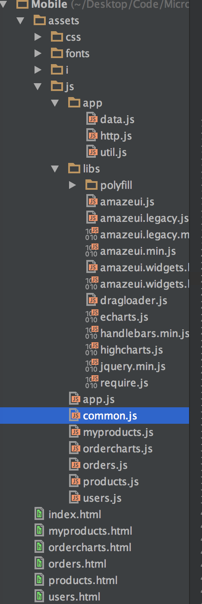

# 项目结构说明

###截图说明

1. assets文件夹存放系统资源
2. css存放样式文件
3. i存放ios和android平台上能够pin到左面的图表
4. js下分为两个文件夹：app文件夹存放通用的数据文件；libs存放基础包文件
5. 其他文件请查看文件结构明细
6. 我们所有的文件都遵守严格模式，请继续遵守

为了对项目命名空间的约束，使用了遵循AMD规则的RequireJS对自定义的包文件进行编译，具体请参考结项目编译。

包括引入库文件和自定义命名空间，定义了如下可供调用的命名空间

| 命名空间 | 说明 |
| -- | -- |
| http | 针对REST的封装，返回能够支持Promise模式的对象 |
| data | 不同操作内容的数据封装，任何需要连接AJAX获取数据的行为都要在此中定义 |
| common | 针对获取数据列表并且能够编辑某一项的页面的封装 |
| util | js小功能封装 |

